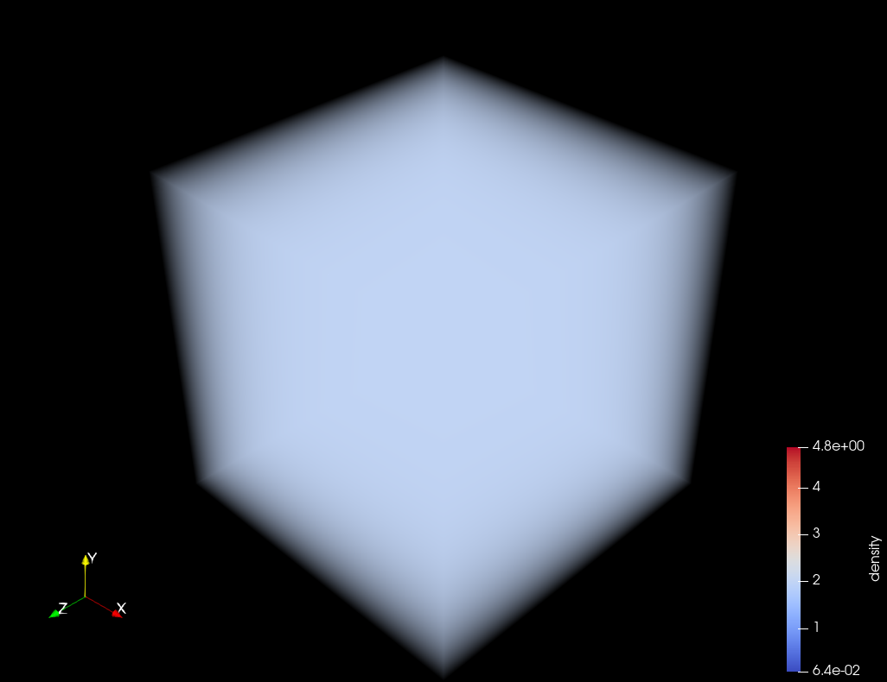
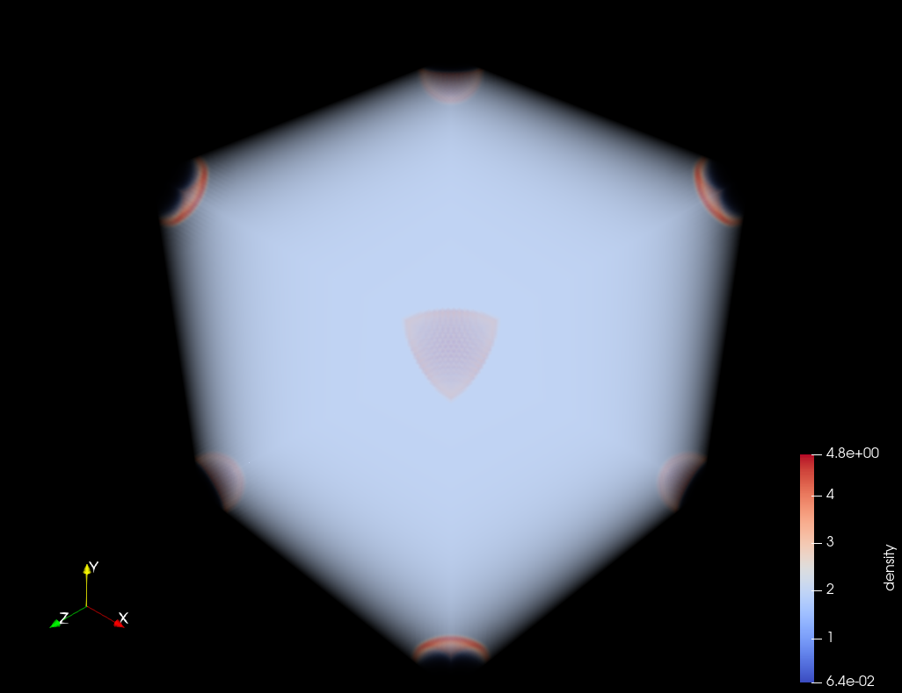

## Summary
==========

**Ramses2VTKHDF** is a Python-based tool that converts simulation outputs generated by the **RAMSES** astrophysical code into the widely supported **VTKHDF** format. It enables direct and efficient visualization of simulation data in **ParaView** and other compatible platforms by translating RAMSES’s complex binary outputs into a clean, hierarchical structure suited for interactive exploration.

RAMSES, an adaptive mesh refinement simulation framework used to study galactic evolution and interstellar structures, produces highly detailed yet visualization-intensive data. Ramses2VTKHDF reconstructs this multi-level structure while preserving essential physical quantities such as density, pressure, and velocity, allowing researchers to interpret large-scale cosmic simulations with clarity.

This tool provides a bridge between high-resolution simulations and accessible analysis workflows, improving reproducibility and interoperability within computational astrophysics—making advanced cosmic data easier to interpret, share, and extend within open-science ecosystems.

## Statement of Need
====================

Astrophysical simulations are essential for studying the formation and evolution of cosmic structures. RAMSES, a high‑resolution simulation framework, uses adaptive mesh refinement (AMR) to model physical processes such as interstellar filament evolution and galactic dynamics. However, its complex binary output format makes direct visualization and interpretation of results challenging for researchers.

Existing tools for RAMSES data visualization, including yt and meshio, offer partial solutions but often require extensive configuration, manual processing, or fail to preserve full AMR hierarchies. These limitations reduce accessibility and complicate the scientific workflow, particularly for large‑scale cosmological datasets.

Ramses2VTKHDF addresses this challenge through a Python‑based, open‑source tool that converts RAMSES outputs into the VTKHDF format, which is natively supported by the latest versions of ParaView. This conversion enables efficient, multi‑resolution 3D visualization while preserving essential physical quantities such as density, pressure, velocity and many more. By automating data conversion and maintaining structural fidelity, Ramses2VTKHDF promotes open, reproducible, and accessible research workflows in computational astrophysics.

## Functionality Overview
=========================

Ramses2VTKHDF converts outputs from the RAMSES astrophysical code into the VTKHDF OverlappingAMR format, enabling detailed visualization in ParaView.

The conversion process involves the following key steps:

1. **Data Extraction:** The tool reads RAMSES simulation outputs using libraries like Osyris and h5py, accessing the hierarchical adaptive mesh refinement (AMR) grid and the associated physical fields.

2. **AMR Hierarchy Reconstruction:** It reorganizes simulation cells according to their refinement levels, preserving the multi-scale spatial structure critical for accurate scientific interpretation.

3. **Field Mapping:** Key scalar and vector fields—including density, pressure, velocity, magnetic field, and gravitational potential—are extracted and assigned to corresponding grid cells without interpolation or modification.

4. **VTKHDF Generation:** The hierarchical data is encoded into a single `.vtkhdf` file, maintaining the AMR structure and enabling efficient storage and loading.

5. **Visualization:** The generated VTKHDF file can be loaded directly into ParaView, where researchers can explore simulation data interactively, leveraging multi-resolution visualization to analyze cosmic phenomena.

Users interact with Ramses2VTKHDF via a command-line interface (CLI) or Python API, with flexible options for input directories, field selection, output file prefixes, and a dry-run mode for previewing conversions. The package also includes an automated test suite that ensures reliability and reproducibility of the conversion process.

## Results and Performance
==========================

Ramses2VTKHDF's performance was assessed using two RAMSES datasets: the Sedov 3D blast wave and a complex filamentary structure dataset.

The Sedov 3D dataset served primarily for volume-rendered visualization validation due to its manageable size and straightforward features, ensuring rapid processing and confirming the faithful preservation of physical fields such as density, pressure and velocity.

The filament dataset, characterized by a large-scale, multilevel adaptive mesh refinement (AMR) hierarchy, was used for more rigorous benchmarking. It offered a challenging test of the tool’s ability to maintain data fidelity while handling significant computational workload.

Results show Ramses2VTKHDF excels in preserving the AMR hierarchical structure and all relevant physical fields within the VTKHDF format, enabling detailed scientific analysis. Conversion performance was efficient, with no significant memory usage concerns during the conversion process itself.

Notably, memory usage becomes a primary consideration during visualization in ParaView, especially for large AMR datasets like the filament data. ParaView loads the hierarchical data progressively, but large datasets can demand considerable RAM, potentially impacting interactive visualization performance. Therefore, while Ramses2VTKHDF outputs are optimized for structure and fidelity, users should consider hardware limitations when exploring extensive datasets.

Overall, Ramses2VTKHDF provides a robust and reproducible solution for astrophysical simulation post-processing, balancing accuracy with practical performance.

<table>
  <tr>
    <td>
      
      
<b>Figure X:</b> Volume rendering of Sedov 3D output at timestep 00001.

    </td>
    <td>
      
      
<b>Figure Y:</b> Volume rendering of Sedov 3D output at timestep 00002.

    </td>
  </tr>
</table>

## Acknowledgements
===================

The author thanks Sri. Shubhankar Ravindra Gharote for his invaluable mentorship and guidance throughout this project. His support and insights were critical to the successful development and completion of this work.

The author also acknowledges the facilities and support provided by the Space Applications Centre, Indian Space Research Organisation (ISRO), Ahmedabad.

## References
=============